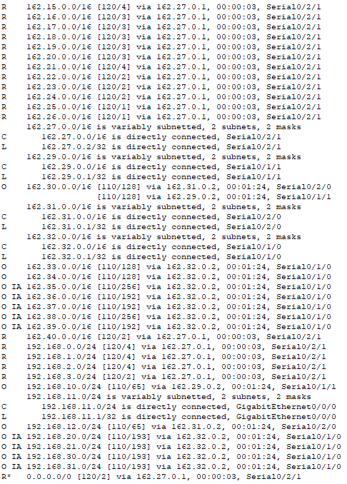

## Content
1. [Description](#description)
2. [Routing Table 1](#routing-table-1)
3. [Routing Table 2](#routing-table-2)
4. [NAT Translation](#nat-translation)
5. [DHCP VLAN's server](#dhcp-vlan's-server)
- [serverPool](#serverpool)
- [No DNS](#no-dns)
6. [Individual DHCP servers](#individual-dhcp-servers)
7. [BGP Neighbors](#bgp-neighbors)
---

## Description
Global Enterprise Network made on Packet Tracer with multi area OSPF, RIPv2, EIGRP and BGP routes, VTP protocol for VLAN's and NAT translation for internet access.
Also has DHCP servers and a global DNS server accesible through NAT.

---

## Routing Table 1

Routing table of a frontier router between RIPv2 and OSPF

---

## Routing Table 2

Routing table of a frontier router between EIGRP and BGP

---

## NAT Translation

Running-config of frame-relay router who has on it's networks the global DNS server and an HTTP server.

---

## DHCP VLAN's server
Configuration of the DHCP server for the 4 vlan's
- **serverPool**: It's Vlan 10, but you can't change serverPool default name.
- **No DNS**: This group of Vlan's are not connected to internet.

---

## Individual DHCP servers

For each network that doesn't have VLAN's i've used this configuration with the DNS server included.

---

## BGP Neighbors

Autonomous Systems numbered as 100, 200 and 300.

---
