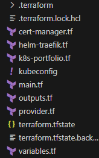
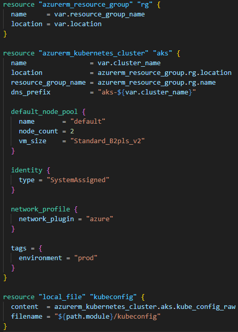
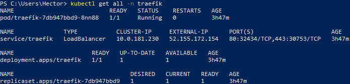
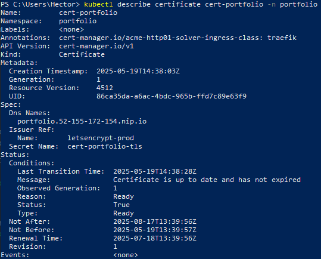
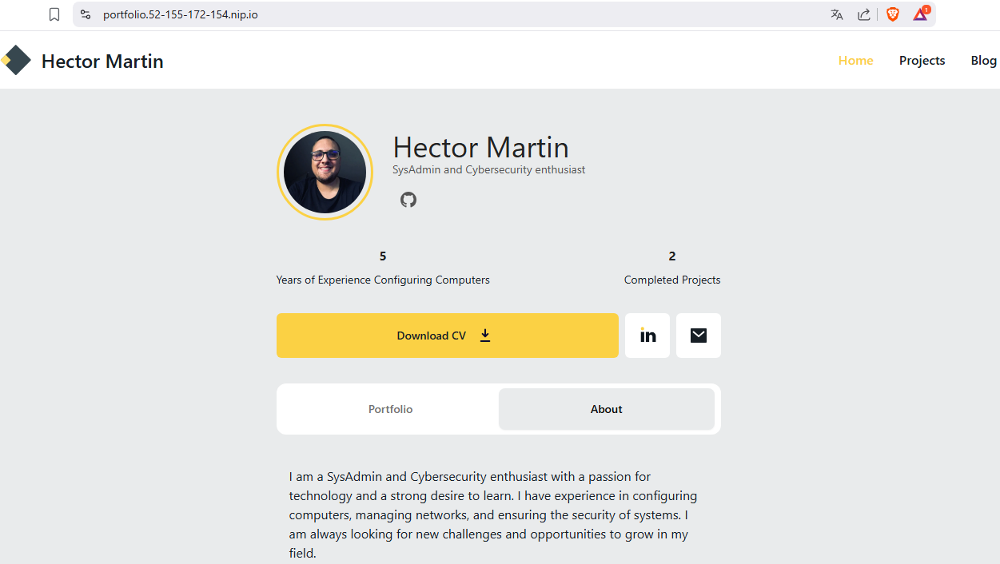

## Table of Contents
1. [Overview](#overview)
2. [Project Structure](#project-structure)
3. [Main](#main)
4. [Traefik](#traefik)
5. [Cert-Manager and Let's Encrypt](#cert-manager-and-lets-encrypt)
6. [Purpose](#purpose)

---

## Overview
This project demonstrates the ability to design, deploy, and maintain a modern cloud infrastructure based on Kubernetes, using infrastructure-as-code tools and following industry best practices. The experience gained provides a solid foundation for continued professional growth in the fields of systems administration, DevOps, and platform engineering.

---

## Project Structure
This project is divided in various .tf files

---

## Main

This is the main file used to deploy the AKS cluster.

---

## Traefik

I'm using traefik, installed with a helm chart as load balancer and ingress controller.

---

## Cert-Manager and Let's Encrypt

For SSL certificates, I'm installing cert-manager via a Helm chart and integrating it with Let's Encrypt.

---

## Purpose

The purpose of this project is to deploy this same web portfolio with a valid certificate and make it accessible on the internet

---
